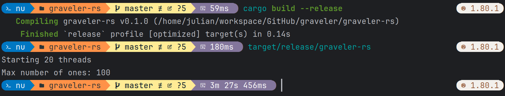

# Graveler RS
Simulates the likeleyhood of escaping Pikasprey's Graveler soft lock.
It is a blazingly fast multi-threaded implementation of the original Python script by [ShoddyCast](https://www.youtube.com/watch?v=M8C8dHQE2Ro) in rust.

## Usage
```bash
cargo run
```

This library automatically uses all available CPU cores. For best performance, build in release mode and time the run separately:
```bash
cargo build --release
./target/release/graveler-rs
```

On my laptop running a i9-12900HK CPU the script takes approximately 3.5 minutes to complete:
